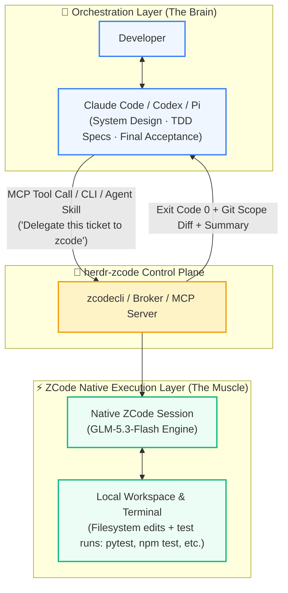

<div align="center">

# herdr-zcode ⚡

### The High-Throughput, Cost-Effective Execution Layer for Multi-Agent Systems
**Harness ZCode's 50% Quota Bonus and GLM-5.3-Flash as the Dedicated Execution Engine for Claude Code, Codex, and Pi**

[](https://herdr.dev)
[](LICENSE)
[](#)
[-brightgreen.svg)](#)
[](#)

[ 🇺🇸 English ](README.md) • [ 🇨🇳 简体中文 ](README_CN.md)

---
</div>

## 💡 Why herdr-zcode?

Frontier LLMs (such as Claude 3.7 Sonnet, Claude Opus, and GPT-4o) excel at system-level architecture, deep context comprehension, and complex problem decomposition. However, using these expensive frontier models directly for **repetitive, low-level execution**—editing boilerplate code, running linters, iterating across failed unit tests, and parsing 500-line stack traces—introduces critical bottlenecks:

1. **Token Cost Explosion**: Iterative trial-and-error runs burn through premium frontier model quotas at alarming rates.
2. **Rate Limits & Budget Exhaustion**: Frequent tool calls quickly hit hourly or weekly token allowances in CLI tools like Claude Code.
3. **Context Window Pollution**: Hundreds of lines of transient compiler warnings, test logs, and intermediate diffs clutter the orchestrator's context window, degrading subsequent reasoning and architectural choices.

**`herdr-zcode` cleanly separates the "Brain" from the "Muscle":**

- **The Orchestrator (Brain)**: Claude Code / Codex / Pi acts as the **Tech Lead**, driving architectural design, user requirements, test specification (TDD), and tracer-bullet ticket decomposition.
- **The Execution Layer (Muscle)**: `herdr-zcode` delegates concrete coding tickets to a local, native **ZCode** instance (powered by GLM-5.3-Flash). It runs inside isolated git workspaces, autonomously writes code, executes tests, self-heals, and returns deterministic, structured facts.



---

## 🪙 The Economic Driver: ZCode 50% Quota Bonus & Token Arbitrage

Why use ZCode as the execution engine?

1. **Native 50% Quota Bonus**: ZCode provides an ongoing **50% extra token/quota grant**, delivering exceptionally low per-token operational costs.
2. **Ultra-Fast Code Engine (GLM-5.3-Flash)**: Specifically optimized for rapid code generation, tool calls, and high-volume iterations.
3. **Maximized Multi-Agent ROI**:
   - **Top 10% Tokens on Reasoning**: The master model consumes minimal tokens for architectural planning and reviewing diffs.
   - **Bottom 90% Tokens on Execution**: Heavy trial-and-error, code edits, and lint-test cycles run on ZCode's heavily subsidized 50% bonus quota.
   - **Reduces overall token expenditures by 70%–85%** while eliminating rate-limit anxiety.

---

## 📊 FAB Analysis (Features · Advantages · Benefits)

| Dimension | Feature | Advantage | Benefit |
| :--- | :--- | :--- | :--- |
| **Compute & Cost** | Connects to native ZCode engine (GLM-5.3-Flash) for autonomous batch tasks | **Capitalizes on ZCode's 50% bonus quota** to absorb heavy, trial-and-error execution loops | **Slashes token bills by 70%–85%**; saves precious Claude/OpenAI quota for high-value reasoning |
| **Clean Architecture** | Dispatches tickets via Herdr IPC, CLI commands, or standard MCP protocol | **Zero context pollution**; bulky test outputs and intermediate compiler logs stay in the execution pane | **Superior reasoning quality**; master model maintains long-horizon context and focus |
| **Verification Gate** | Enforces `--verify <cmd>` execution and `--scope <paths>` containment checks | **Zero-trust verification**; never trusts LLM verbal claims of "Done"; gates on exit code 0 and git diff | **Reliable deliveries**; prevents hallucinations, scope creep, and untested broken code |
| **Runtime Control** | Deep Herdr multiplexer integration with live streaming and `/steer` redirection | **Seamless in-flight redirection**; stream live thoughts and tool calls; redirect without losing session memory | **Real-time intervention**; tweak prompts mid-turn without restarting processes or hitting lock races |
| **Concurrency** | Supports independent git worktree paths per pane (`chat-open`) | **Horizontal task parallelism**; bypasses single-directory locks to execute multiple tickets concurrently | **Multiplied throughput**; master agent can orchestrate 3–5 parallel worker panes simultaneously |

---

## 🚀 Use Cases & Scenarios

### Scenario 1: Tech Lead & Developer (Master-Worker Orchestration)
- **Challenge**: Developing a large feature across 10+ files causes the master model to lose context, hallucinate, or timeout.
- **Solution**: Claude Code designs the solution and slices it into focused tickets. Each ticket is dispatched to ZCode:
  ```bash
  zcodecli send "Implement JWT refresh token rotation middleware" \
    --scope src/auth/tokens.py \
    --verify "pytest tests/test_tokens.py" \
    --mode edit
  ```
  ZCode iterates and fixes issues until `pytest` passes cleanly.

### Scenario 2: TDD Automated Red-to-Green Bug Fixing
- **Workflow**:
  1. The master agent reproduces the reported bug by writing a failing test assertion (Red).
  2. The ticket is delegated to ZCode with the instruction to make that test pass (Green).
  3. ZCode analyzes errors, edits source files, and verifies against the test suite.
  4. Only when the verify command exits with code `0` is the patch accepted. If it fails, ZCode automatically reworks (up to 2 rounds).

### Scenario 3: Mass Refactoring & Monorepo Migrations
- **Scenario**: Monorepo-wide upgrades (e.g., adding strict Python type hints, migrating Vue 2 options to Vue 3 composition API, bulk API deprecations).
- **Solution**: Spawn multiple worktree-isolated panes with `zcodecli chat-open`. ZCode workers digest dozens of tickets in parallel, burning subsidized 50% bonus quota instead of expensive frontier tokens.

### Scenario 4: Split-Screen Interactive Pair Programming
- **Layout**: In Herdr, open Claude Code on the left for architectural discussions, and a ZCode TUI (`zcodecli chat-open`) on the right.
- **Workflow**: Brainstorm system designs with Claude, then hand off localized implementations to ZCode on the right pane with real-time visual monitoring.

---

## 🌟 Key Selling Points

1. 🪙 **The 50% Quota Arbitrage**:
   Purpose-built for cost-conscious AI developers. Converts ZCode's native 50% quota bonus into an economical workhorse pipeline.
2. 🛡️ **Hard-Gated Zero-Trust Evidence**:
   Rejects the LLM habit of claiming "All tests passed!" when they didn't. Accepts work ONLY when `verify exit code == 0` and `changed_files ⊆ scope`. All evidence is serialized to disk (`results/<task_id>.json`).
3. 🔌 **Frictionless Universal Integration**:
   - **CLI**: Standard `zcodecli` and `nar` binaries in PATH.
   - **MCP Server**: Pre-built `zcodecli-mcp` service injects directly into Claude Code and Codex with one command.
   - **Agent Skill**: Ready-to-use `zcode-bridge` skill triggers whenever you tell your agent: *"Delegate this ticket to zcode"*.
4. 🎛️ **Live Streaming & In-Flight Steering**:
   Watch ZCode think and invoke tools (`▸ tool`, `✓ result`) in real time. If it goes off track, simply issue `/steer <new instruction>` to safely redirect the turn in the **same native session** without wiping conversation context.
5. 💻 **Full Cross-Platform Support (macOS / Linux / Windows)**:
   Powered by pure Python and headless runtimes. Windows supported natively as of v0.6.0 with graceful file locking degradation.

---

## 📦 Installation & Quick Start

### 1. Prerequisites
Ensure ZCode is installed and authenticated:
```bash
# Verify ZCode authentication (must have valid OAuth credentials)
zcode login
```
Requirements: Python 3.10+, Node.js >= 22, Git, and [Herdr](https://herdr.dev).

### 2. Install Herdr Plugin
Install via the Herdr plugin manager:
```bash
herdr plugin install Nofuture123/herdr-zcode
```
The installer validates dependencies, bootstraps the runtime, and sets up `zcodecli` in your PATH.

### 3. Inject MCP & Agent Skills

Expose ZCode tools to Claude Code and Codex:
```bash
# Inject MCP server into Claude Code and Codex
sh ~/.local/share/herdr-zcode/scripts/inject-mcp.sh all

# Install the universal agent skill
sh ~/.local/share/herdr-zcode/scripts/install-skill.sh
```

Now, prompt Claude Code or Codex:
> **"Analyze this ticket, write a reproduction test, and delegate the implementation to zcode."**

---

## 💻 CLI Usage

### Basic Commands
```bash
zcodecli open                     # Open serial reception queue pane
zcodecli chat-open                # Open dedicated native ZCode session pane (for parallel work)
zcodecli send "Summarize repo"    # Send full-access plain text task
zcodecli result                   # Fetch parsed result and evidence of latest task
zcodecli read --lines 30          # Read live streaming terminal output
zcodecli list                     # List all tasks and statuses
zcodecli inspect <task_id>        # Inspect full task evidence (diff, verify output, tokens)
zcodecli cancel <task_id>         # Safely cancel an in-flight task
```

### Dispatching a Structured Task with Verification
```bash
zcodecli send "Fix off-by-one error in pagination" \
  --mode edit \
  --scope src/api/pagination.py \
  --verify "pytest tests/test_pagination.py" \
  --key ticket-402 \
  --timeout 300
```

### In-Flight Steering
Redirect a running task without losing context:
```bash
zcodecli steer "Make sure to maintain backward compatibility with v1 clients"
```
The executor safely cancels the active turn and restarts with the updated instruction in the **same native session**.

---

## 🛡️ Security & Permission Model

- **Default Permissions**: Runs with full user permissions (yolo mode / auto-approve) to enable frictionless autonomous tool execution.
- **Tightening Permissions**:
  - Per-task: Pass `--mode edit` (restricts writes to `--scope`) or `--mode plan` (read-only analysis).
  - Globally: Export `QAB_DEFAULT_MODE=edit` and `QAB_DEFAULT_POLICY=deny` in the executor environment.
- **Safety Invariants**:
  - Never delegate arbitrary deletions outside scope, `git push`, global configuration changes, or financial transactions.
  - Permission denials fail-closed by default; never widen scope mid-flight.

---

## 📚 Documentation

- [Orchestrator Collaboration Guide](docs/ORCHESTRATOR-GUIDE.md)
- [Agent Skill Specification](skills/zcode-bridge/SKILL.md)
- [Verification Evidence Chain (13 Audit Rounds)](docs/VERIFICATION.md)
- [Herdr Publishing Guide](PUBLISHING.md)

---

## 📄 License

Released under the [MIT License](LICENSE). Contributions, issues, and PRs are welcome!
