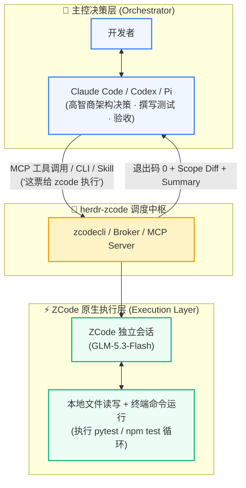

<div align="center">

# herdr-zcode ⚡

### 多 Agent 架构的高吞吐、高性价比代码执行层
**将 ZCode 50% 赠送额度与 GLM-5.3-Flash 转化为 Claude Code、Codex、Pi 的超级施工队**

[](https://herdr.dev)
[](LICENSE)
[](#)
[-brightgreen.svg)](#)
[](#)

[ 🇺🇸 English ](README.md) • [ 🇨🇳 简体中文 ](README_CN.md)

---
</div>

## 💡 为什么需要 herdr-zcode？
在现代 AI 辅助研发流程中，前沿推理与主控模型（如 Codex / GPT-5 系列、Claude Sonnet/Opus、DeepSeek 系列）具备极高水准的系统架构设计、复杂上下文理解和需求拆解能力。然而，如果直接让昂贵的主控模型去**执行**具体的代码改写、修复语法错误、反复跑单元测试、抓取数十次报错堆栈，会面临三大致命痛点：
1. **Token 账单爆炸**：反复试错跑测会迅速消耗海量 Frontier Tokens，单次微小修复成本高昂。
2. **频率与额度限制（Rate Limits）**：高频工具调用容易迅速耗尽 Claude Code 周期配额。
3. **上下文空间污染（Context Pollution）**：数百行的编译报错、构建日志和中间试错过程堆满主控上下文，显著拉低后续推理与架构决策质量。

**`herdr-zcode` 彻底解耦“大脑（规划与决策）”与“双手（代码执行与自愈）”：**

- **主控层（Orchestrator）**：由 Claude Code / Codex / Pi 担任“技术主管（Tech Lead）”，负责业务理解、系统架构、测试用例编写与工单拆解。
- **执行层（Execution Layer）**：由 `herdr-zcode` 驱动本地原生 ZCode（基于 GLM-5.3-Flash 高吞吐模型），在沙盒/独立工作区内专注读写文件、运行测试、自愈修复，并返回结构化事实。



---

## 🪙 核心经济学：ZCode 50% 额度赠送与算力套利

为什么执行层首选 ZCode？

1. **官方 50% 额度赠送红利**：ZCode 平台原生常态化提供高达 **50% 的赠送额度**与极高调用配额，使单次 Token 的实际持有成本极低。
2. **极高吞吐与代码专精**：底座搭载针对代码生成与工具调用高度优化的 **GLM-5.3-Flash**，响应极快，非常适合大批量搬砖、单测迭代与样板代码生成。
3. **极致 ROI 的多 Agent 协作比**：
   - **10% 的 Token 花在刀刃上**：昂贵的主控模型仅消耗几千 Token 用于任务规划与最终 diff 审查。
   - **90% 的重体力消耗交给 ZCode**：反复修改、格式化、单测执行循环消耗成千上万 Token，全部由享受 50% 赠送的 ZCode 额度消化。
   - **整体开发成本下降 70% ~ 85%**，同时彻底摆脱主控模型的速率限制与额度焦虑！

---

## 📊 FAB 分析（特性 · 优势 · 效益）

| 维度 | Feature (功能特性) | Advantage (竞争优势) | Benefit (商业与开发价值) |
| :--- | :--- | :--- | :--- |
| **算力与经济** | 桥接原生 ZCode 执行引擎（GLM-5.3-Flash），支持全自动批处理任务 | **充分利用 ZCode 50% 额度赠送**，以极低边际成本运行高耗 Token 的重试执行循环 | **Token 支出直降 70%~85%**；不再因日常调试而耗尽昂贵的 Claude 周期额度 |
| **架构解耦** | 主控 Agent 通过 Herdr IPC、CLI 或标准 MCP 协议向下派发独立工单 | **主控上下文零污染**；数千行中间构建日志、编译错误留在底层执行窗，不污染主控上下文 | **决策质量大幅提升**；主控长周期记忆保持敏锐，上下文窗口永远干净专注 |
| **验收机制** | 强制执行 `--verify <cmd>` 门禁命令与 `--scope <paths>` 白名单校验 | **零信任、防假绿**；绝不轻信 Agent 口头的“已完成”，必须以 Bash Exit 0 和 Git Diff 范围为客观事实 | **交付高度可靠**；杜绝代码幻觉，避免越界修改无关文件或假装测试通过 |
| **运行调度** | 深度集成 Herdr 多路复用终端，支持实时终端流与 `/steer` 动态转向 | **无需中断冷启动**；可实时直观查看 ZCode 思考与工具调用，随时追加新指令且保持会话历史 | **毫秒级干预与纠偏**；发现偏离预期可立即重定向，无需杀进程重头再来 |
| **并发扩展** | 支持独立工作区（Git Worktree）绑定独立 ZCode 窗格 (`chat-open`) | **多任务横向并行**；规避单目录串行锁，充分发挥多核与多会话吞吐潜力 | **吞吐量翻倍提升**；单个主控可同时派发 3~5 个独立特性工单交由多个 ZCode 并行消化 |

---

## 🚀 典型使用场景 (Use Cases)

### 场景 1：指挥官与施工队模式（Master-Worker Orchestration）
- **痛点**：大型特性开发涉及修改 10+ 个文件，若由 Claude Code 逐个编写测试并修改实现，极易中途丢上下文或超时。
- **解法**：Claude Code 作为 Tech Lead，拆分出 5 张细粒度工单（包含输入、输出、白名单路径、检验单测）。每一张工单直接委托：
  ```bash
  zcodecli send "实现用户认证中间件并处理 Token 过期" \
    --scope src/auth/jwt.py \
    --verify "pytest tests/test_auth.py" \
    --mode edit
  ```
  ZCode 负责写代码并反复自测，直到 `pytest` 完全通过才交付。

### 场景 2：TDD 自动化红绿闭环（Red-to-Green Bug Fixing）
- **流程**：
  1. 主控 Agent 依据用户反馈的 Bug，先在测试文件中编写一个重现问题的失败用例（Red）。
  2. 主控派发任务给 ZCode，指定必须跑通该单测（Green）。
  3. ZCode 在受限目录下自由发挥、定位错误并修改源码，执行层脚本自动捕获 verify 退出码。
  4. 只有退出码为 0，主控才合并该修改，否则触发自动返工（最多 2 轮），全自动且严谨。

### 场景 3：大规模机械重构与脚手架迁移（Mass Refactoring）
- **场景**：工程全量升级（如 Python 类型标注补全、Vue2 到 Vue3 模板语法迁移、批量 API 签名变更）。
- **解法**：建立独立的 Git Worktree，开启多个 ZCode 窗格（`zcodecli chat-open`），让 ZCode 批量跑脚本并修正边缘语法，把最耗费 Token 的体力活全部消耗在 ZCode 的 50% 赠送额度上。

### 场景 4：人机协同分屏开发（Split-Screen Pair Programming）
- **界面**：借助 Herdr 分屏，左侧开启 Claude Code 探讨架构思路，右侧开启 ZCode 原生 TUI（`zcodecli chat-open`）。
- **操作**：聊出方案后，右侧直接一键唤醒 ZCode 落地实现，两边实时对照，透明可感。

---

## 🌟 核心卖点 (Key Selling Points)

1. 🪙 **50% 额度杠杆与算力套利**：
   专为精打细算的高频 AI 开发者打造，将 ZCode 的官方优惠额度转化为最廉价、最高吞吐的执行流水线。
2. 🛡️ **硬核事实凭证，向“自吹自擂”说不**：
   桥接层只相信物理事实（`exit code 0`、`diff.changed_files ⊆ scope`、真实运行日志），生成落盘结果报告（`results/<task_id>.json`），彻底解决大模型“声称改好了其实没改对”的行业痛点。
3. 🔌 **零门槛全生态无缝接入**：
   - **命令行**：提供原生可执行脚本 `zcodecli` 与 `nar`。
   - **MCP 协议**：提供 `zcodecli-mcp` 服务，一键注入 Claude Code 与 Codex，主控直接获得 `submit/result/inspect/cancel` 工具。
   - **Agent 技能**：内置 `zcode-bridge` Skill，AI 只要看到「这票给 zcode 执行」即可全自动驱动。
4. 🎛️ **实时可视化与动态中途干预（Live Streaming & In-Flight Steering）**：
   终端实时显示 ZCode 的每一次思考与工具调用（`▸ tool`、`✓ result`）。发现思路走偏？随时敲入 `/steer <新指令>`，任务立即平滑重定向，原生会话上下文不丢失，且自动绕开并发文件锁冲突。
5. 💻 **全平台支持（macOS / Linux / Windows）**：
   底层由 Python 标准库与无头适配层驱动，Windows/macOS/Linux 全面兼容，平滑降级。

---

## 📦 安装与快速开始

### 1. 前置准备
确保已安装并登录 ZCode：
```bash
# 检查 ZCode 是否已认证（必须包含 OAuth 凭证）
zcode login
```
系统环境要求：Python 3.10+、Node.js >= 22、Git、以及 [Herdr](https://herdr.dev)。

### 2. 一键安装插件
在 Herdr 插件管理器中安装：
```bash
herdr plugin install Nofuture123/herdr-zcode
```
安装脚本会自动进行环境体检、构建运行时并安装 `zcodecli` 命令行工具到系统 PATH。

### 3. 一键配置主控 Agent（MCP / Skill）

将 ZCode 工具一键注入到 Claude Code 和 Codex：
```bash
# 注入 MCP 工具到 Claude Code 和 Codex
sh ~/.local/share/herdr-zcode/scripts/inject-mcp.sh all

# 安装通用 Agent Skill
sh ~/.local/share/herdr-zcode/scripts/install-skill.sh
```

现在，只需在 Claude Code 或 Codex 中输入：
> **“请帮我分析这个需求，拆解出测试用例，然后把具体实现委派给 zcode 执行。”**

---

## 💻 常用命令与交互

### CLI 基础操作
```bash
zcodecli open                     # 打开默认收发台窗格（串行队列）
zcodecli chat-open                # 创建独立的 ZCode 原生会话窗格（多票并行推荐）
zcodecli send "总结项目核心模块"      # 向执行器发送纯文本全权限任务
zcodecli result                   # 获取最近一票的结构化执行结果与凭据
zcodecli read --lines 30          # 查看执行器终端实时滚动的输出
zcodecli list                     # 列出所有执行任务及其状态
zcodecli inspect <task_id>        # 查看任务详细凭据（Diff / Verify 输出 / Token 用量）
zcodecli cancel <task_id>         # 取消正在执行中的任务
```

### 标准工单派发示例（带验证与范围白名单）
```bash
zcodecli send "优化数据库查询缓存逻辑" \
  --mode edit \
  --scope src/db/cache.py \
  --verify "python -m unittest tests/test_cache.py" \
  --key ticket-1024 \
  --timeout 300
```

### 运行时动态转向（Steering）
如果发现当前正在跑的任务需要补充条件或调整方向，无需杀掉重来：
```bash
zcodecli steer "注意：缓存淘汰策略必须采用 LRU，不要用 FIFO"
```
执行器会安全取消当前步，并将新要求无缝追加在**同一个原生 ZCode 会话**中继续推进，上下文完整保留！

---

## 🛡️ 安全与权限规范

- **执行器默认权限**：出于自动化流畅度考虑，默认在所有者授权下以较高权限（yolo / auto-approve）运行。
- **权限收紧方式**：
  - 单任务级别：在任务参数中声明 `--mode edit`（限制写范围）或 `--mode plan`（仅分析不写文件）。
  - 全局环境变量：可在执行器窗格中预设 `QAB_DEFAULT_MODE=edit` 与 `QAB_DEFAULT_POLICY=deny`。
- **硬性安全铁律**：
  - 禁止委派范围外的文件删除、`git push`、改写系统全局配置、外部支付等高危行为。
  - 遇到权限拒绝（Permission Denied）默认阻断，禁止中途擅自放宽 Scope。

---

## 📚 延伸阅读

- [主控 Agent 协作指引 (ORCHESTRATOR-GUIDE.md)](docs/ORCHESTRATOR-GUIDE.md)
- [桥接规范与 Agent 技能定义 (SKILL.md)](skills/zcode-bridge/SKILL.md)
- [13 轮审计与真实验证证据链 (VERIFICATION.md)](docs/VERIFICATION.md)
- [发布与分发清单 (PUBLISHING.md)](PUBLISHING.md)

---

## 📄 开源许可证

本项目基于 [MIT License](LICENSE) 开源发布。欢迎提 Issue 与 PR！
